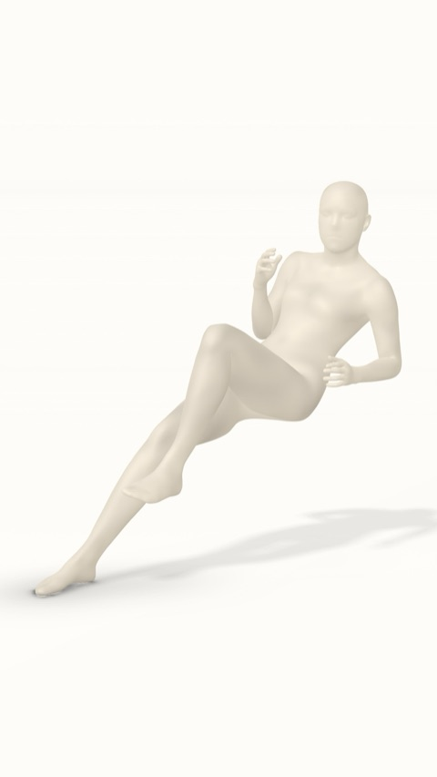
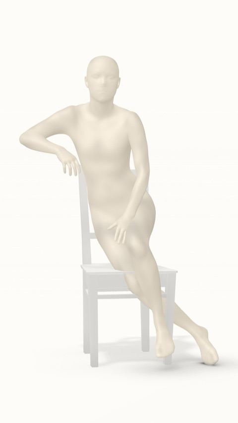
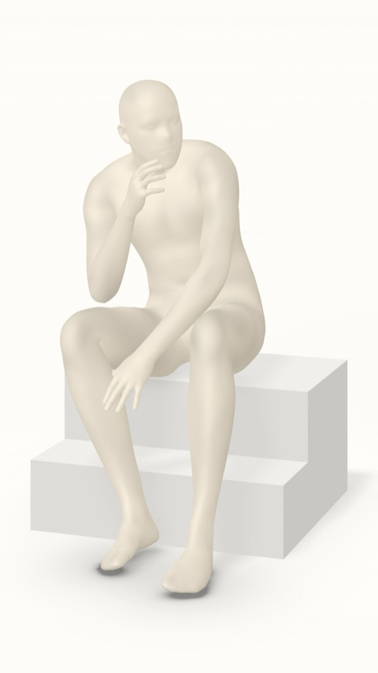
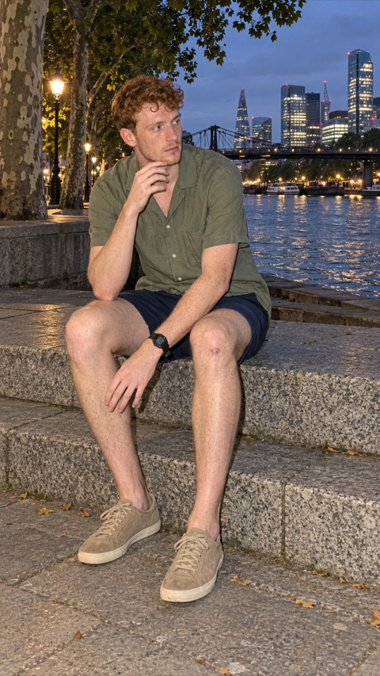

## The problem

Standing in front of a wall, a bench or some steps, most people don't know how to pose. Good pose ideas exist,
but they are scattered, unnamed and repeated many times over, with no way to tell which ones suit a seat, a wall or
open space.

This project is a data processing pipeline that turns that mess into a clean pose library: it finds the distinct
poses, groups the repeats, names each pose type and learns what kind of spot it needs. Every pose then gets a
neutral mannequin version and a fresh photo built from it, so the library is ready to suggest "try these 3 poses
here" for any spot.

## Results

Each pose becomes a mannequin, then a new photo that keeps the exact pose.

| Mannequin | Generated photo |
|---|---|
|  |  |
|  |  |
|  |  |
